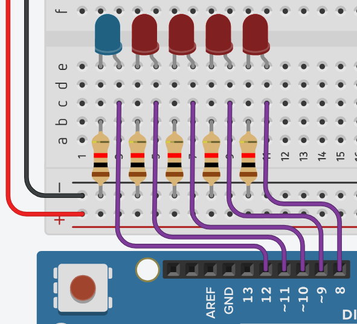
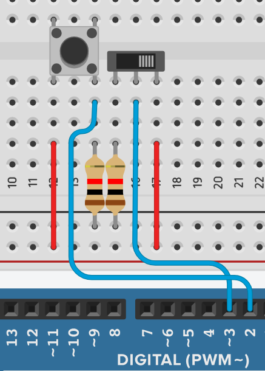
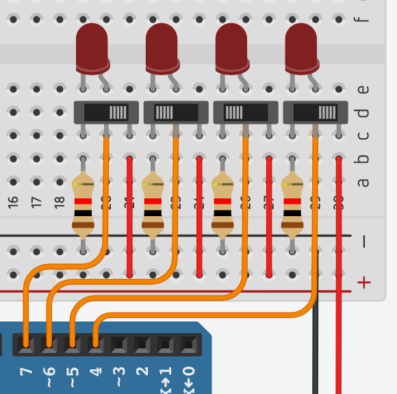

# Installation Guide 📥

## 🔌 Necessary Components
- 1 Arduino Uno
- 8 LEDs
- 8 resistors (220Ω)
- 2 buttons
- 8 pull-down resistors (10kΩ)
- Jumper wires
- Breadboard

## 🔧 Circuit Assembly
1. Connect the LEDs to the output pins (8 to 11 for bits and 12 for carry).
    
      

2. Connect the buttons to the input pins (2 and 3).

      

3. Connect the input bits to the pins (4 to 7).

      
4. Use pull-down resistors to ensure LOW states when the buttons are not pressed.
5. Connect the Arduino to the computer and upload the [Binary Adder Code](../binaryAdder.cpp).